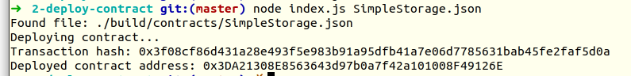

# Gitcoin: 2) Deploy A Simple Ethereum Smart Contract On Polyjuice

## A screenshot of the console output immediately after you have successfully deployed a smart contract.



## The transaction hash from the contract deployment (in text format).

```
0x3f08cf86d431a28e493f5e983b91a95dfb41a7e06d7785631bab45fe2faf5d0a
```

## The deployed contract address from the contract deployment (in text format).

```
0x3DA21308E8563643d97b0a7f42a101008F49126E
``` 
