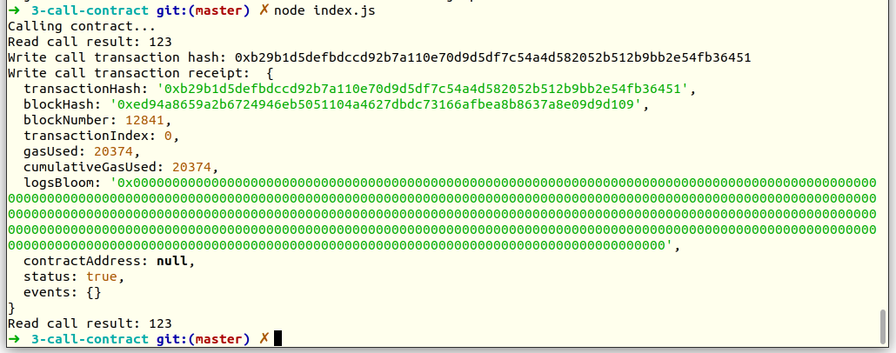

# Gitcoin: 3) Issue A Smart Contract Call To The Deployed Smart Contract

## A screenshot of the console output immediately after you have successfully issued a smart contract call.



## The transaction hash from the console output (in text format).

```
0xb29b1d5defbdccd92b7a110e70d9d5df7c54a4d582052b512b9bb2e54fb36451
```

## The contract address that you called (in text format).

```
0x3DA21308E8563643d97b0a7f42a101008F49126E
```

### The ABI for contract you made a call on (in text format).

```JSON
[
  {
    "inputs": [],
    "stateMutability": "payable",
    "type": "constructor"
  },
  {
    "inputs": [
      {
        "internalType": "uint256",
        "name": "x",
        "type": "uint256"
      }
    ],
    "name": "set",
    "outputs": [],
    "stateMutability": "payable",
    "type": "function"
  },
  {
    "inputs": [],
    "name": "get",
    "outputs": [
      {
        "internalType": "uint256",
        "name": "",
        "type": "uint256"
      }
    ],
    "stateMutability": "view",
    "type": "function"
  }
]
```

