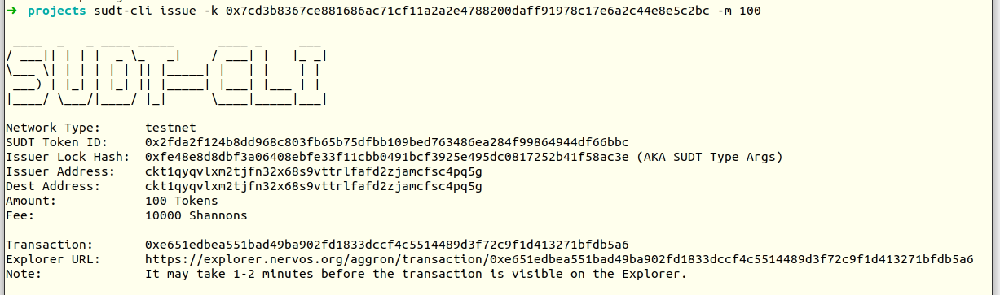
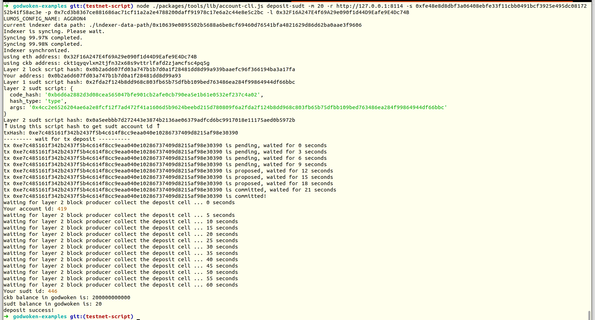

# Gitcoin: 4) Issue An SUDT Token On Layer 1 And Deposit It To Layer 2

## A link to the Layer 1 address you funded on the Testnet Explorer.

[https://explorer.nervos.org/aggron/address/ckt1qyqvlxm2tjfn32x68s9vttrlfafd2zjamcfsc4pq5g](https://explorer.nervos.org/aggron/address/ckt1qyqvlxm2tjfn32x68s9vttrlfafd2zjamcfsc4pq5g)

## A screenshot of the console output immediately after using sudt-cli to create your SUDT tokens on Layer 1.



## A link to the transaction ID created by sudt-cli on the Testnet Explorer.

[](https://explorer.nervos.org/aggron/transaction/0xe651edbea551bad49ba902fd1833dccf4c5514489d3f72c9f1d413271bfdb5a6)

## A screenshot of the console output immediately after you have successfully submitted a deposit to Layer 2 using the account-cli tool.



## The SUDT ID from the console output after executing the deposit script (in text format).

```
446
```

