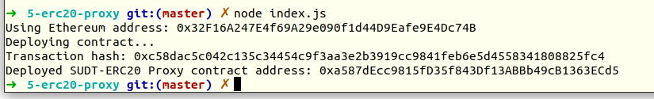
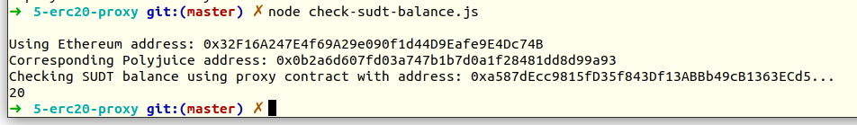

# Gitcoin: 5) Deploy The ERC20 Proxy Contract For The Deposited SUDT

## A screenshot of the console output immediately after deploying smart contract.



## The address of the ERC20 Proxy Contract you deployed (in text format).

```
0xa587dEcc9815fD35f843Df13ABBb49cB1363ECd5
```

## A screenshot of the console output immediately after checking your SUDT balance.



### The Ethereum address that was checked (in text format).

```
0x32F16A247E4f69A29e090f1d44D9Eafe9E4Dc74B
```

