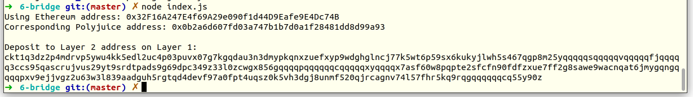

# Gitcoin: 6) Use Force Bridge To Deposit Tokens From Ethereum To Polyjuice

## A screenshot of the console output immediately after you have successfully generated your Deposit Receiver Address.



## Your Deposit Receiver Address (in text format).

```
ckt1q3dz2p4mdrvp5ywu4kk5edl2uc4p03puvx07g7kgqdau3n3dmypkqnxzuefxyp9wdghglncj77k5wt6p59sx6kukyjlwh5s467qgp8m25yqqqqqsqqqqqvqqqqqfjqqqqq3ccs95qascrujvus29yt9srdtpads9g69dpc349z33l0zcwgx856gqqqqpqqqqqqcqqqqqxyqqqqx7asf60w8pqpte2sfcfn90fdfzxue7ff2g8sawe9wacnqat6jmygqngqqqqpxv9ejjvgz2u63w3l839aadguh5rgtqd4devf97a0fpt4uqsz0k5vh3dgj8unmf520qjrcagnv74l57fhr5kq9rqgqqqqqqcq55y90z
```

## The Ethereum address used to generate the Deposit Receiver Address (in text format).

```
0x32F16A247E4f69A29e090f1d44D9Eafe9E4Dc74B
```

## A link to the Etherscan explorer for the successful Force Bridge transaction. This can be found on Force Bridge under History→Succeed.

[](https://rinkeby.etherscan.io/tx/0x8d44fd9da5360c83a2fc69542ebf657868212e9e3faf357da89afeb4efa2e832)

## A link to the Nervos explorer for the successful Force bridge transaction. This can be found on Force Bridge under History→Succeed.

[](https://explorer.nervos.org/aggron/transaction/0xf4143f2f0b6550e87c5088dfdfbc4c3a640266066bfd1df006108f3d549eb497)


